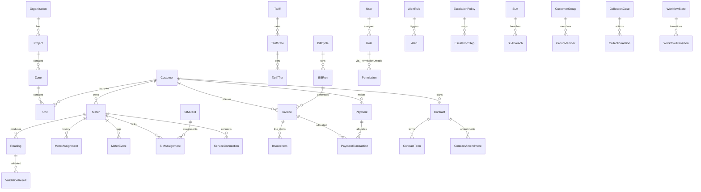

# MeterVerse ER Diagram (Mermaid)
# Generated: 2026-07-25
# Tables: 86 across public schema

```mermaid
erDiagram
    Organization ||--o{ Project : has
    Project ||--o{ Zone : contains
    Zone ||--o{ Unit : contains
    Customer ||--o{ Meter : owns
    Customer ||--o{ Invoice : receives
    Customer ||--o{ Payment : makes
    Customer ||--o{ Contract : signs
    Customer ||--o{ Unit : occupies
    Meter ||--o{ Reading : produces
    Meter ||--o{ MeterAssignment : history
    Meter ||--o{ MeterEvent : logs
    Meter ||--o{ SIMAssignment : links
    Meter ||--o{ ServiceConnection : connects
    Reading ||--o{ ValidationResult : validated
    Invoice ||--o{ InvoiceItem : line_items
    Invoice ||--o{ PaymentTransaction : allocated
    Payment ||--o{ PaymentTransaction : allocates
    Tariff ||--o{ TariffRate : rates
    TariffRate ||--o{ TariffTier : tiers
    BillCycle ||--o{ BillRun : runs
    BillRun ||--o{ Invoice : generates
    Contract ||--o{ ContractTerm : terms
    Contract ||--o{ ContractAmendment : amendments
    SIMCard ||--o{ SIMAssignment : assignments
    User ||--o{ Role : assigned
    Role ||--o{ Permission : via_PermissionOnRole
    AlertRule ||--o{ Alert : triggers
    EscalationPolicy ||--o{ EscalationStep : steps
    SLA ||--o{ SLABreach : breaches
    CustomerGroup ||--o{ GroupMember : members
    CollectionCase ||--o{ CollectionAction : actions
    WorkflowState ||--o{ WorkflowTransition : transitions
```
