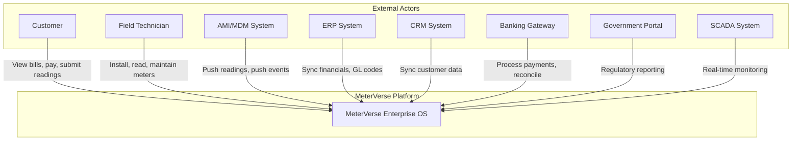
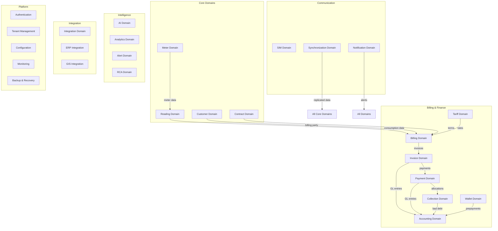
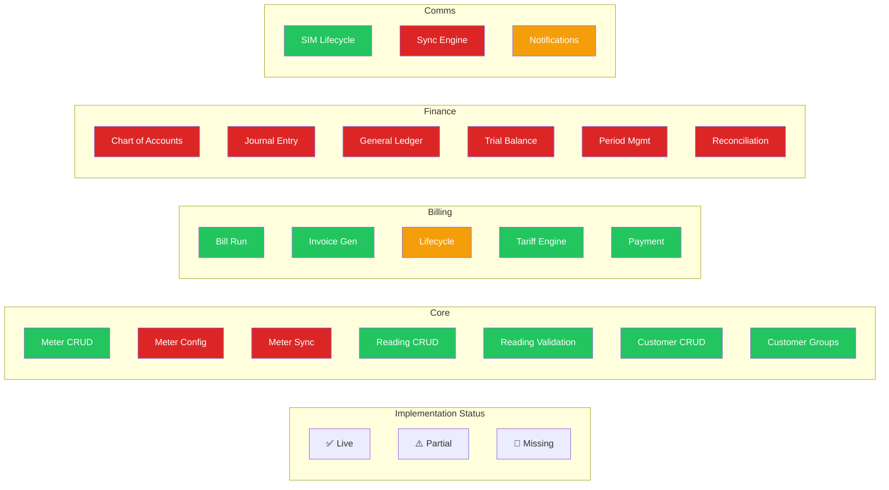
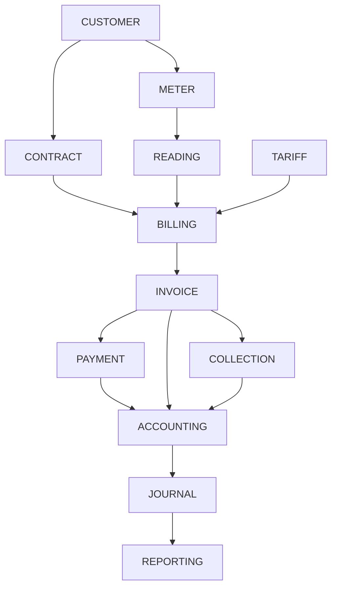
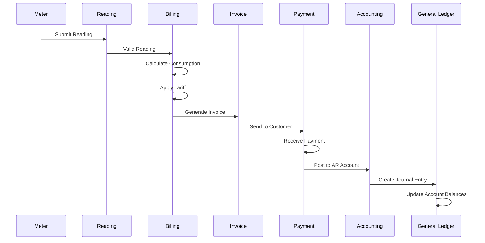

# Domain Architecture Diagrams

**File:** `_diagrams/DOMAIN_DIAGRAMS.md`
**Status:** Enterprise Planning Phase

---

## 1. Context Diagram (C4 Level 1)

## 2. Domain Map

## 3. Capability Map (Heat Map)

## 4. Dependency Graph (Top 10 Domains)

## 5. BPMN: Invoice-to-Payment Process

## 6. Ownership Map

| Domain | Team | Tech Lead | DB Owner |
|--------|------|-----------|----------|
| Meter | Meter Operations | Backend Team | Core DB |
| Reading | Meter Data Mgmt | Backend Team | Core DB |
| Customer | CRM Team | Full Stack Team | Core DB |
| Billing | Billing Team | Backend Team | Core DB |
| Accounting | Finance Team | Backend Team | Core DB |
| AI | AI Platform Team | AI Team | Intelligence DB |
| Platform | Platform Team | DevOps Team | System DB |
| Integration | Integration Team | Backend Team | Core DB |
