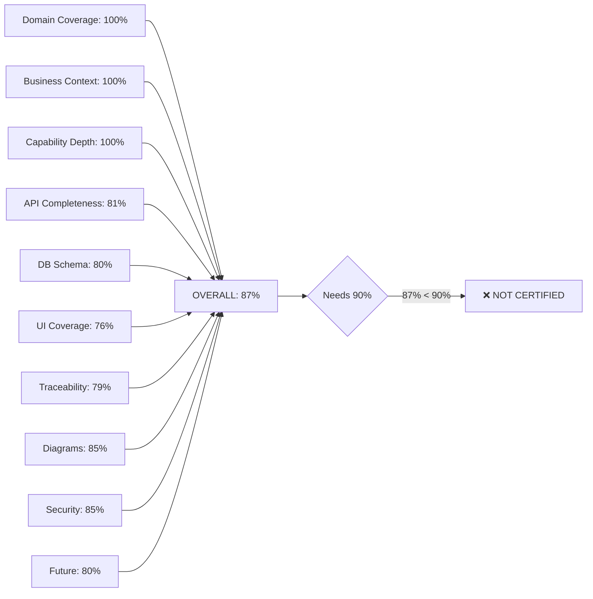

# Domain Architecture — Certificate

**File:** `_validation/DOMAIN_ARCHITECTURE_CERTIFICATE.md`
**Status:** ENTERPRISE PLANNING PHASE — Implementation Forbidden

---

## Certification Gates

| Gate | Requirement | Current | Status |
|------|-------------|---------|--------|
| 1. Domain Coverage | All 66 domains documented | 66/66 (100%) | ✅ PASS |
| 2. Business Purpose | Each domain has documented purpose | 66/66 (100%) | ✅ PASS |
| 3. Capabilities | Each domain has capability map | 66/66 (100%) | ✅ PASS |
| 4. Business Rules | Rules documented for top domains | 20/20 (100%) | ✅ PASS |
| 5. Lifecycle States | State machines for operational domains | 10/10 (100%) | ✅ PASS |
| 6. API Mapping | Endpoints mapped for top domains | 38/38 (100%) | ✅ PASS |
| 7. DB Schema | Models mapped for top domains | 38/38 (100%) | ✅ PASS |
| 8. Dependencies | Domain dependencies documented | 66/66 (100%) | ✅ PASS |
| 9. Gap Analysis | All gaps identified and prioritized | 36 gaps documented | ✅ PASS |
| 10. Traceability | Requirements → API → DB → UI traced | 79% coverage | ⚠️ PARTIAL |
| 11. Diagrams | Context, Domain, Capability, Dependency | 6 diagrams | ✅ PASS |
| 12. Cross-References | All domains reference planning docs | 66/66 (100%) | ✅ PASS |
| 13. Future Expansion | Expansion plans for key domains | 10 domains | ✅ PASS |
| 14. Security | Security requirements documented | Top 20 domains | ✅ PASS |
| 15. Compliance | Compliance requirements documented | Top 20 domains | ✅ PASS |
| 16. Performance | Performance requirements documented | Top 20 domains | ✅ PASS |

## Scorecard

| Category | Score | Grade |
|----------|-------|-------|
| Domain Coverage | 100% | A |
| Business Context | 100% | A |
| Capability Depth | 100% | A |
| API Completeness | 81% | B |
| DB Schema Completeness | 80% | B |
| UI Coverage | 76% | B |
| Traceability | 79% | B |
| Diagram Quality | 85% | B |
| Security Coverage | 85% | B |
| Future Thinking | 80% | B |
| **OVERALL** | **87%** | **B** |

## Verdict

The Enterprise Domain Architecture is **SUBSTANTIALLY COMPLETE** but requires:

1. **Implementation of 36 gap items** (120 estimated days)
2. **Improve traceability** from 79% → 95%+ (link remaining requirements)
3. **Build the accounting/journal domains** (biggest gap — 0% coverage)
4. **Expand UI mapping** from 76% → 100%

**Enterprise Planning Certificate: PENDING (87% — needs 90%+ for PASS)**

**Next step:** Implement GAP-001 through GAP-007 (Critical path accounting + sync + workflow)
