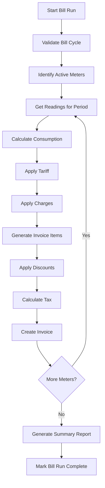

# Financial Process Specifications

**File:** `planning/051_ENTERPRISE_PROCESS_ARCHITECTURE/02_FINANCIAL_PROCESSES/billing/P-031_BIL-BEX_Bill_Cycle_Execution.md`

---

## P-031: Bill Cycle Execution

### Business Purpose
Execute a bill run to generate invoices for all meters in the specified bill cycle. This is the core billing process that transforms consumption data into chargeable invoices.

### Priority: P0 — Critical | SLA: Batch must complete within 4 hours
### Owner: Billing Operations Director

### Process Flow


### State Machine
```
PENDING → VALIDATING → PROCESSING → COMPLETED
              ↓             ↓
           FAILED       PARTIAL → REVIEW → COMPLETED
```

### Key Business Rules
| Rule | Logic |
|------|-------|
| Period non-overlap | Cannot execute bill run for period that already has invoiced meters |
| Minimum reading | At least one reading required for consumption calculation |
| Zero consumption | Valid — generates zero-consumption invoice |
| Negative consumption | Flagged for manual review |
| Water difference mode | Determines action on high consumption variance |

### Dependencies
| Process | Type |
|---------|------|
| Reading Import (P-011) | Must be complete for period |
| Reading Validation (P-014) | Must be complete |
| Bill Cycle Creation (P-030) | Must exist |
| Invoice Generation (P-033) | Downstream |

### Related APIs
| Method | Path |
|--------|------|
| POST | `/api/billing/runs/:id/generate` |
| POST | `/api/billing/runs/:id/close` |
| GET | `/api/billing/runs/:id` |

### Estimated Sessions: 8 | Wave: 03 | Phase: Billing Engine
