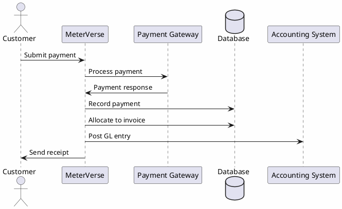
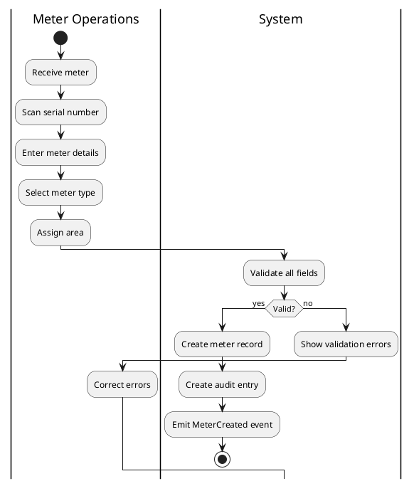
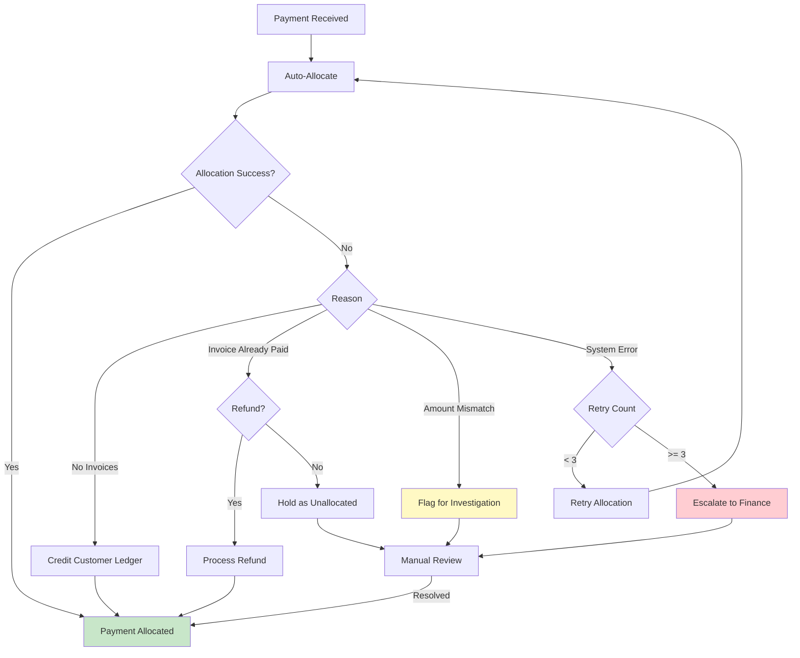
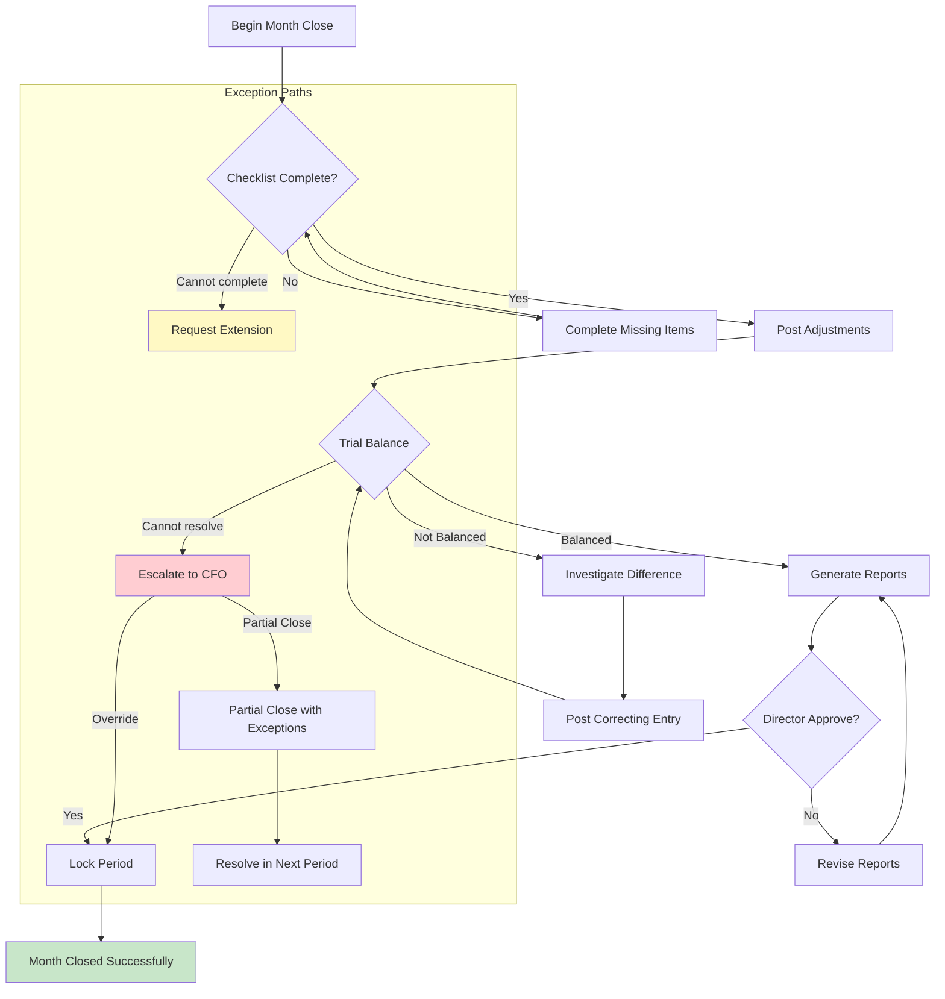

# Advanced Diagrams & Mappings

**File:** `planning/051_ENTERPRISE_PROCESS_ARCHITECTURE/07_DIAGRAMS/PROCESS_ADVANCED_DIAGRAMS.md`

---

## 1. PlantUML Source: Invoice-to-Payment (P-033 → P-045)



## 2. PlantUML Source: Meter Registration (P-001)



## 3. Draw.io XML Source: Login Flow (P-073)

```
<mxfile><diagram id="login-flow"><mxGraphModel dx="800" dy="600"><root>
<mxCell id="0" /><mxCell id="1" parent="0" />
<mxCell id="2" value="User" style="shape=actor;html=1;" vertex="1" parent="1" y="40" />
<mxCell id="3" value="Enter Credentials" style="edgeStyle=orthogonalEdgeStyle;html=1;" edge="1" parent="1" source="2" target="4" />
<mxCell id="4" value="Auth Service" style="shape=hexagon;html=1;" vertex="1" parent="1" x="200" y="40" />
<mxCell id="5" value="Validate Password" style="edgeStyle=orthogonalEdgeStyle;html=1;" edge="1" parent="1" source="4" target="6" />
<mxCell id="6" value="Valid?" style="shape=diamond;html=1;" vertex="1" parent="1" x="400" y="40" />
<mxCell id="7" value="Yes" style="edgeStyle=orthogonalEdgeStyle;html=1;" edge="1" parent="1" source="6" target="8" />
<mxCell id="8" value="Create Session" style="shape=process;html=1;" vertex="1" parent="1" x="550" y="20" />
<mxCell id="9" value="No" style="edgeStyle=orthogonalEdgeStyle;html=1;" edge="1" parent="1" source="6" target="10" />
<mxCell id="10" value="Increment Attempts" style="shape=process;html=1;" vertex="1" parent="1" x="550" y="100" />
</root></mxGraphModel></diagram></mxfile>
```

## 4. Exception Flow Diagram: Failed Reading Import (P-011)

```mermaid
graph TD
    START[Reading Received] --> VALIDATE{Valid Format?}
    VALIDATE -->|No| REJECT[Reject with Format Error]
    VALIDATE -->|Yes| DEDUP{Duplicate?}
    DEDUP -->|Yes| REJECT_DUP[Reject: Duplicate]
    DEDUP -->|No| SAVE[Save Reading]
    SAVE --> VALIDATION{Passes Validation?}
    
    VALIDATION -->|Spike| FLAG_SPIKE[Flag: Spike Review]
    VALIDATION -->|Drop| FLAG_DROP[Flag: Drop Review]
    VALIDATION -->|Negative| FLAG_NEG[Flag: Negative Review]
    VALIDATION -->|Zero Zero| FLAG_ZERO{Valid Zero?}
    FLAG_ZERO -->|Yes (no usage)| APPROVE[Auto-Approve]
    FLAG_ZERO -->|No (meter issue)| FLAG[Flag for Review]
    VALIDATION -->|Pass| APPROVE
    
    APPROVE --> COMPLETE[Done]
    FLAG_SPIKE --> REVIEW[Manual Review]
    FLAG_DROP --> REVIEW
    FLAG_NEG --> REVIEW
    FLAG --> REVIEW
    REVIEW -->|Correct| APPROVE
    REVIEW -->|Incorrect| REJECT_READING[Reject Reading]
    REVIEW -->|Needs Re-read| REQUEST_READING[Request New Reading]
    
    REJECT --> ERROR_LOG[Log Error]
    REJECT_DUP --> ERROR_LOG
    REJECT_READING --> ERROR_LOG
    ERROR_LOG --> COMPLETE
    
    style REJECT fill:#ffcdd2
    style REJECT_DUP fill:#ffcdd2
    style REJECT_READING fill:#ffcdd2
    style APPROVE fill:#c8e6c9
    style FLAG fill:#fff9c4
```

## 5. Exception Flow: Failed Payment Allocation (P-046)



## 6. Exception Flow: Month Close Failed (P-059)



## 7. Business Capability Mapping

| Business Capability | Primary Processes | Supporting Processes | Domain (P09) |
|--------------------|-------------------|---------------------|--------------|
| **Meter Lifecycle Management** | P-001, P-002, P-003, P-004, P-005, P-006 | P-007, P-008, P-009, P-010 | MV-DOM-001 |
| **Meter Data Management** | P-011, P-012, P-013, P-014 | P-015, P-016, P-017, P-018, P-019, P-020 | MV-DOM-002 |
| **Customer Management** | P-021, P-022, P-023, P-024, P-025 | P-079 | MV-DOM-003 |
| **Contract Management** | P-026, P-027, P-028, P-029 | — | MV-DOM-004 |
| **Billing & Invoicing** | P-030, P-031, P-033, P-034, P-036 | P-032, P-035, P-037, P-038, P-042, P-043 | MV-DOM-009, MV-DOM-010 |
| **Payment Processing** | P-045, P-046, P-047 | P-048, P-049, P-050 | MV-DOM-011 |
| **Collections & Recovery** | P-051, P-052, P-053 | P-054 | MV-DOM-016 |
| **Financial Accounting** | P-056, P-057, P-058, P-059, P-060 | — | MV-DOM-013 |
| **SIM & Communication** | P-061, P-062, P-063, P-064, P-065 | — | MV-DOM-026, MV-DOM-027 |
| **Data Synchronization** | P-066, P-067, P-068 | — | MV-DOM-028 |
| **Notification & Alerting** | P-069, P-070, P-071, P-072, P-098, P-099 | — | MV-DOM-029, MV-DOM-036 |
| **User & Access Management** | P-073, P-074, P-075, P-076, P-077, P-078, P-080, P-081 | P-079 | MV-DOM-046, MV-DOM-047 |
| **System Configuration** | P-082, P-083, P-084, P-085 | — | MV-DOM-049 |
| **Platform Operations** | P-086, P-087, P-088, P-089, P-090 | — | MV-DOM-051, MV-DOM-053, MV-DOM-054 |
| **Integration & Sync** | P-101, P-102, P-103, P-104, P-105, P-106 | — | MV-DOM-040, MV-DOM-041 |
| **AI & Intelligence** | P-094, P-095, P-096, P-097 | — | MV-DOM-037, MV-DOM-038, MV-DOM-039 |

## 8. DDD Process Mapping (Bounded Contexts)

```mermaid
graph TD
    subgraph "Bounded Context: Meter Management"
        P001[Meter Registration]
        P002[Meter Assignment]
        P003[Meter Replacement]
        P004[Meter Disconnect]
        P005[Meter Reconnect]
        P006[Meter Retirement]
    end
    
    subgraph "Bounded Context: Meter Data"
        P011[Reading Import]
        P012[Manual Reading]
        P014[Reading Validation]
        P015[Reading Approval]
        P018[Consumption Calc]
    end
    
    subgraph "Bounded Context: Billing"
        P030[Bill Cycle]
        P031[Bill Execution]
        P033[Invoice Gen]
        P034[Invoice Approval]
    end
    
    subgraph "Bounded Context: Payments"
        P045[Payment Reg]
        P046[Payment Alloc]
        P048[Refund]
        P049[Credit Note]
    end
    
    subgraph "Bounded Context: Collections"
        P051[Collection Assign]
        P052[Collection Visit]
        P054[Escalation]
    end
    
    subgraph "Bounded Context: Accounting"
        P056[GL Posting]
        P057[Journal Posting]
        P058[Bank Recon]
        P059[Month Close]
    end
    
    subgraph "Bounded Context: Identity & Access"
        P073[Login]
        P078[User Reg]
        P080[Role Assign]
    end
    
    Meter Management -->|Readings| Meter Data
    Meter Data -->|Consumption| Billing
    Billing -->|Invoices| Payments
    Billing -->|Overdue| Collections
    Billing -->|GL Entries| Accounting
    Payments -->|GL Entries| Accounting
    Collections -->|Write-offs| Accounting
    Identity -->|Authorization| All Contexts
```

## 9. Ownership Mapping (Team → Process)

| Team | Owned Processes | Shared Processes | Domain |
|------|----------------|-----------------|--------|
| **Meter Operations** | P-001 through P-010 | P-011 (readings) | Meter |
| **Meter Data Management** | P-011 through P-020 | P-031, P-033 (billing consumption) | Reading |
| **Customer Service** | P-021 through P-029 | P-036 (invoice delivery) | Customer, Contract |
| **Billing Team** | P-030 through P-044 | P-056 (GL posting) | Billing, Invoice, Tariff |
| **Finance Team** | P-045 through P-060 | — | Payment, Accounting, Collection |
| **Field Operations** | P-003, P-004, P-005, P-012, P-052, P-061, P-062 | — | Meter, Reading, Collection |
| **Platform Engineering** | P-066 through P-072, P-082 through P-093 | All (platform support) | Platform |
| **Security Team** | P-073 through P-077, P-085, P-120 | P-080, P-081 (authorization) | Auth, Security |
| **AI Platform Team** | P-094 through P-097 | — | AI, Knowledge |
| **Integration Team** | P-101 through P-108 | — | Integration |
| **DevOps** | P-086, P-087, P-088, P-089, P-090 | — | Platform |
| **Asset Management** | P-114, P-115, P-116 | — | Asset |
| **Document Management** | P-117, P-118 | — | Document |
