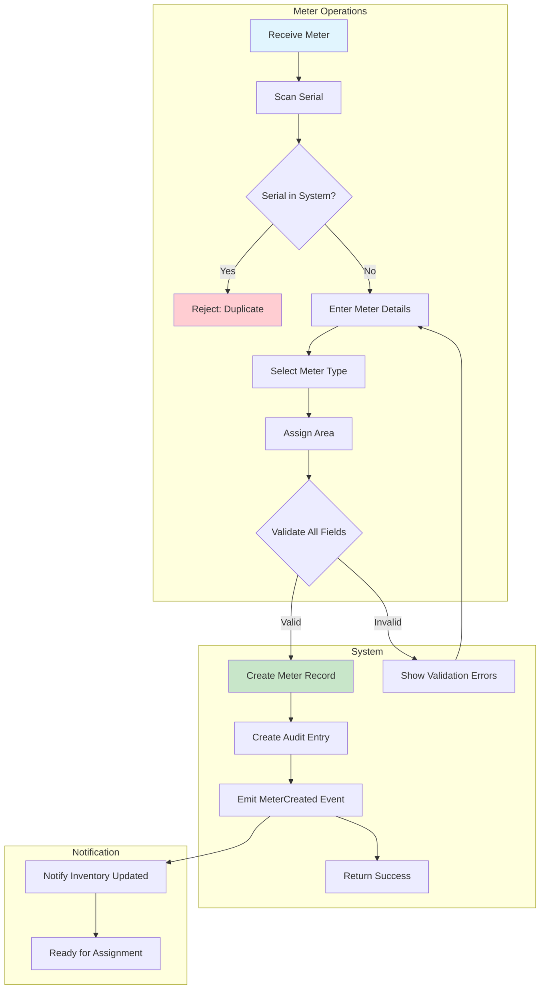
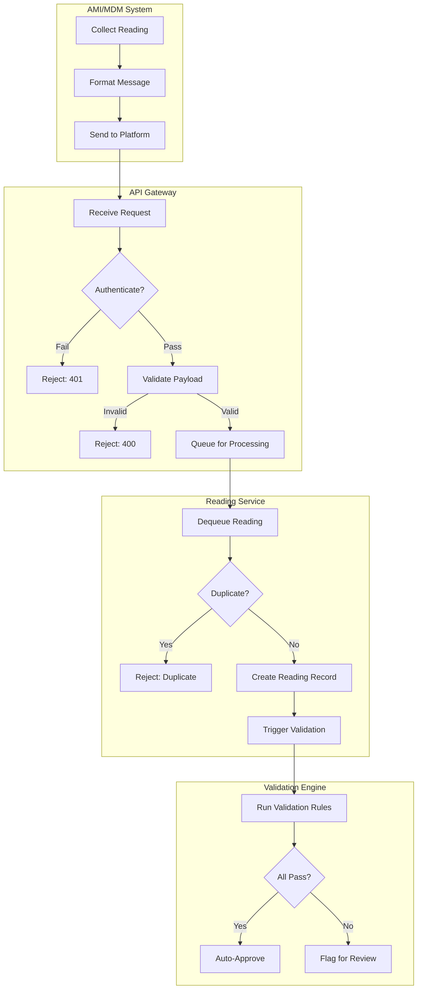
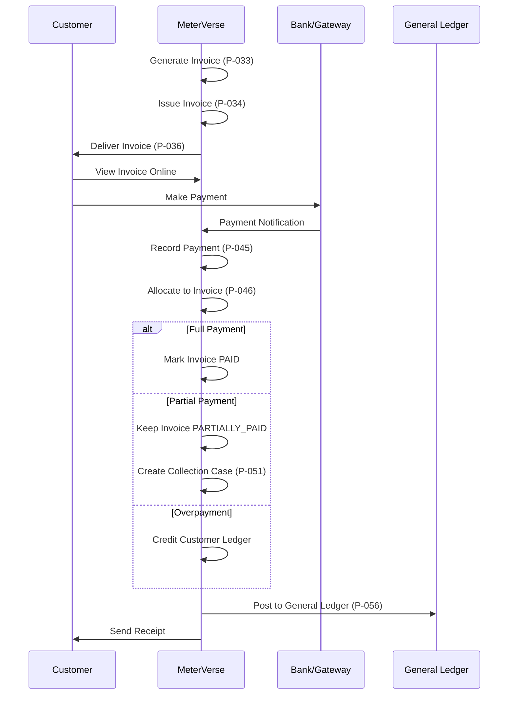
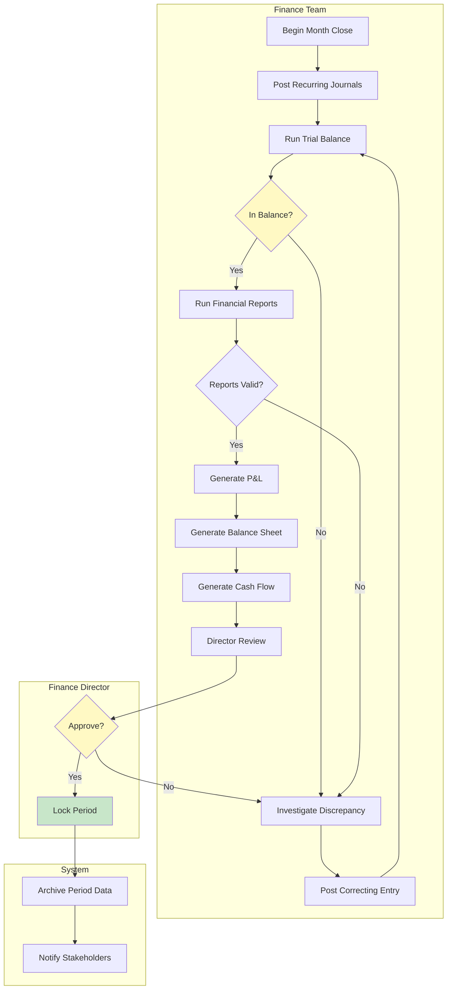
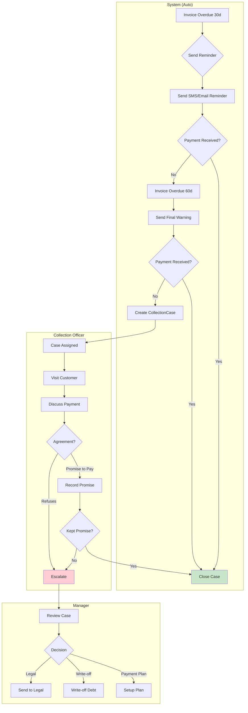
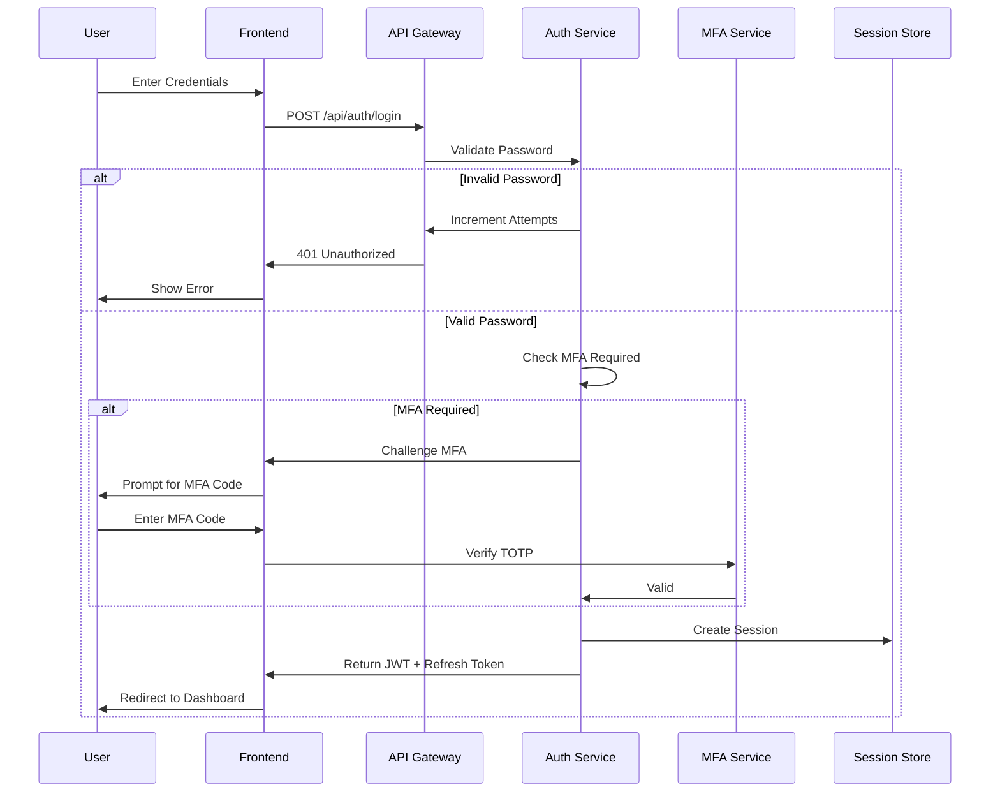
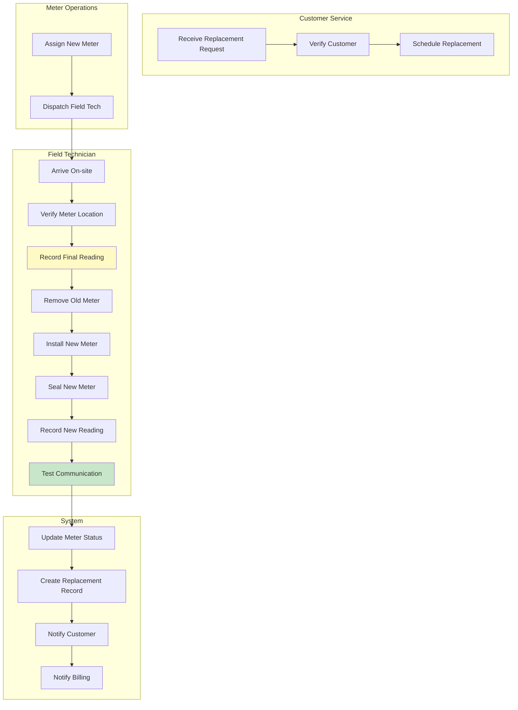
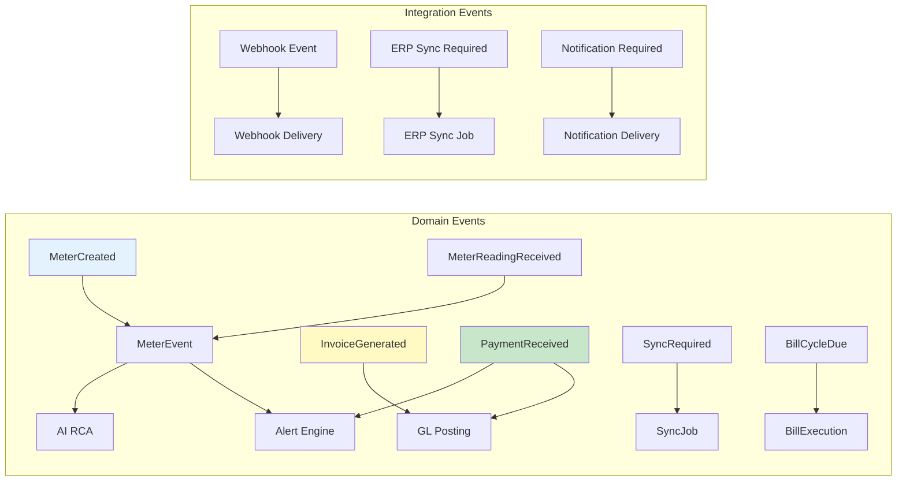
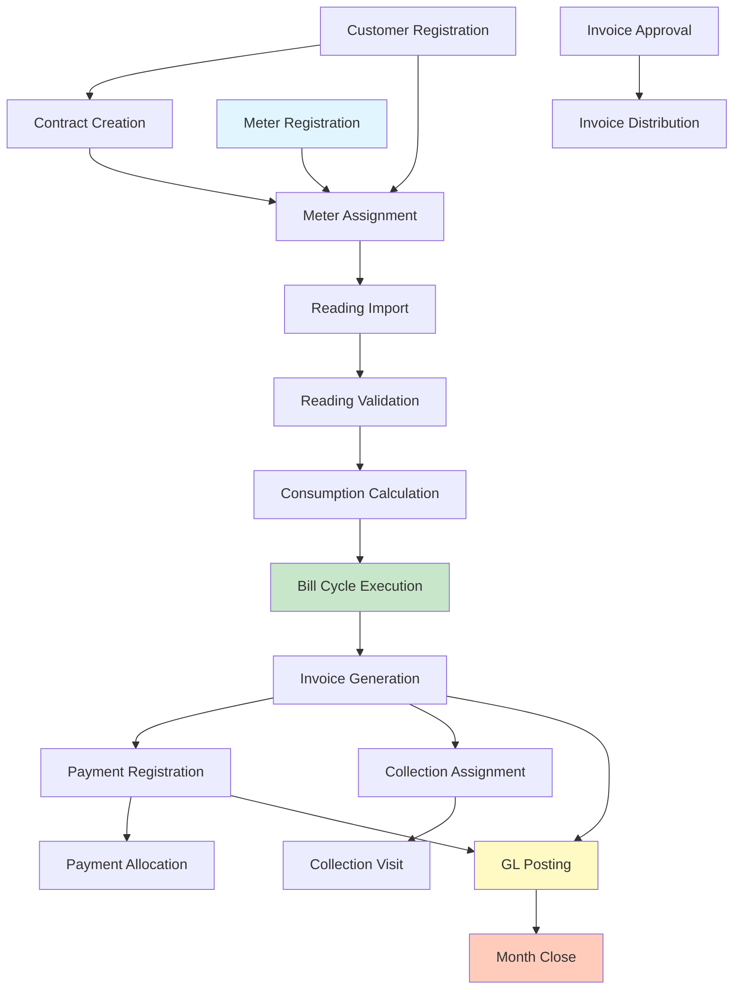

# BPMN Process Diagrams

**File:** `planning/051_ENTERPRISE_PROCESS_ARCHITECTURE/07_DIAGRAMS/PROCESS_BPMN_DIAGRAMS.md`

---

## D-010: Meter Registration (P-001) — BPMN 2.0

## D-011: Reading Import — AMI Integration (P-011) — Swimlane

## D-012: Invoice-to-Payment (P-033 → P-045) — Activity Diagram

## D-013: Month Close Process (P-059) — Activity + Decision

## D-014: Collection Lifecycle (P-051 to P-054) — Swimlane

## D-015: Login Flow (P-073) — Sequence Diagram

## D-016: Meter Replacement (P-003) — Swimlane

## Event Flow Mapping

## Process Dependency Graph (Communication)

