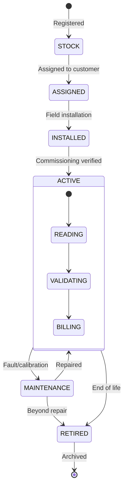
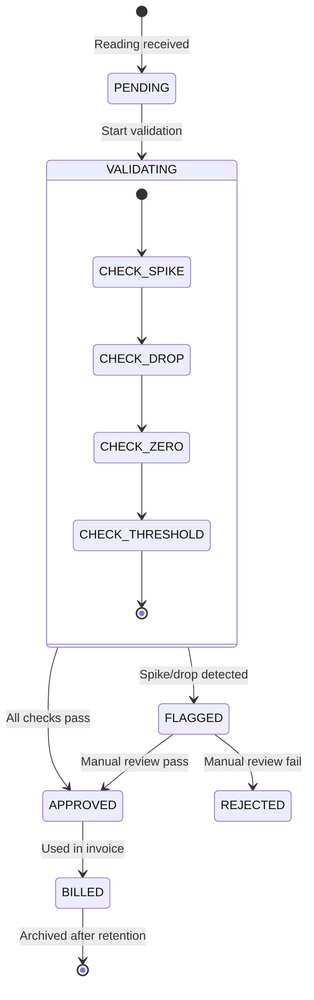
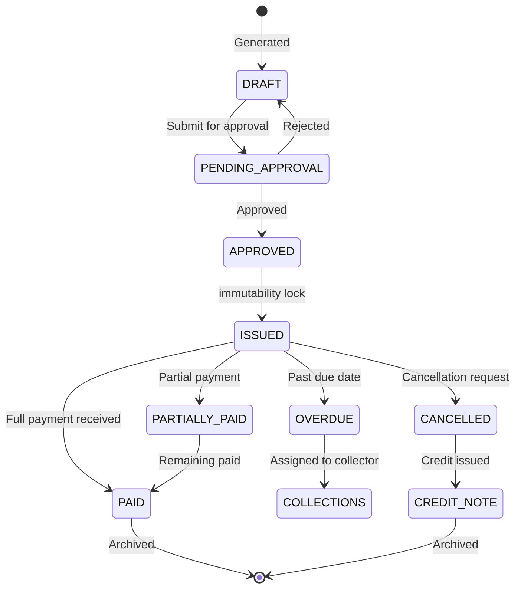
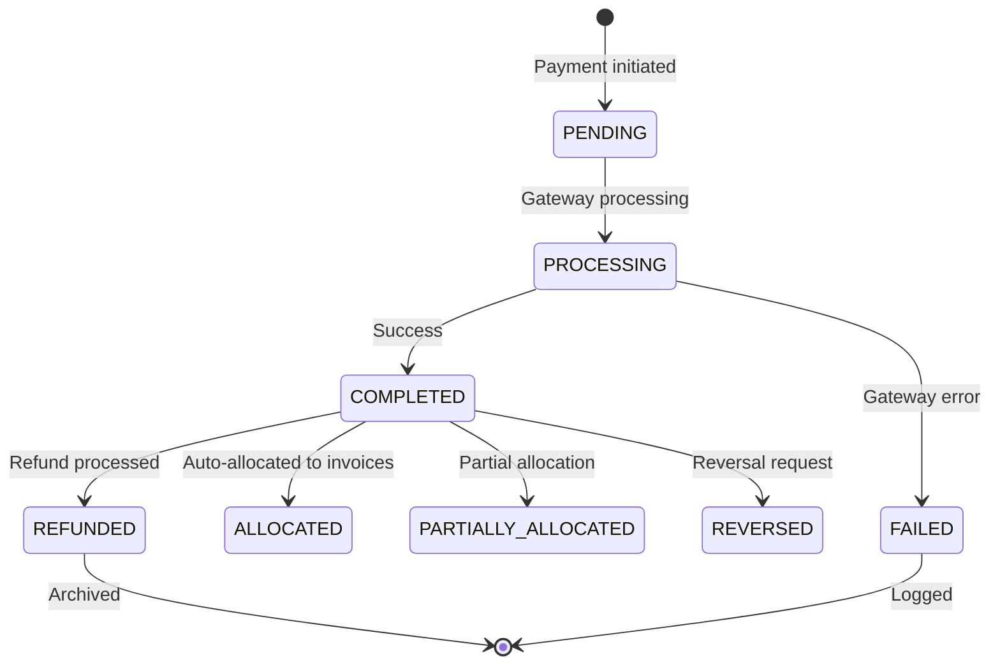
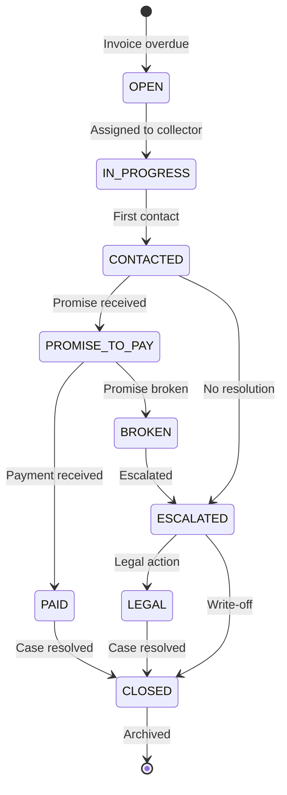
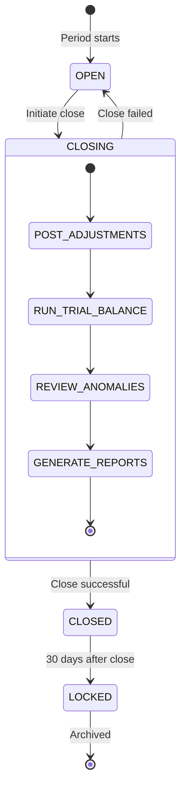
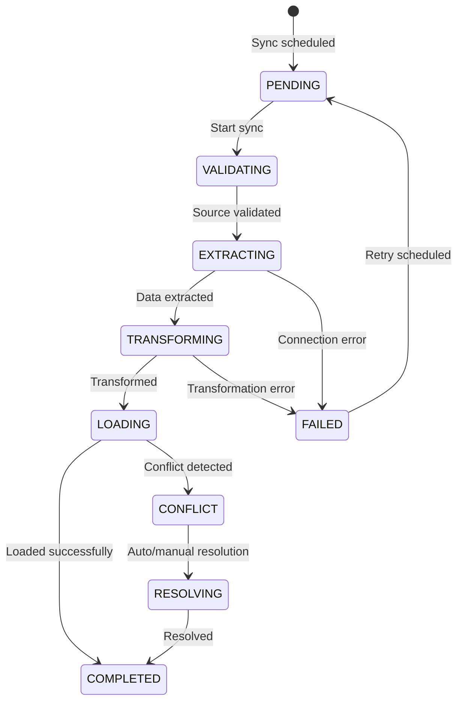
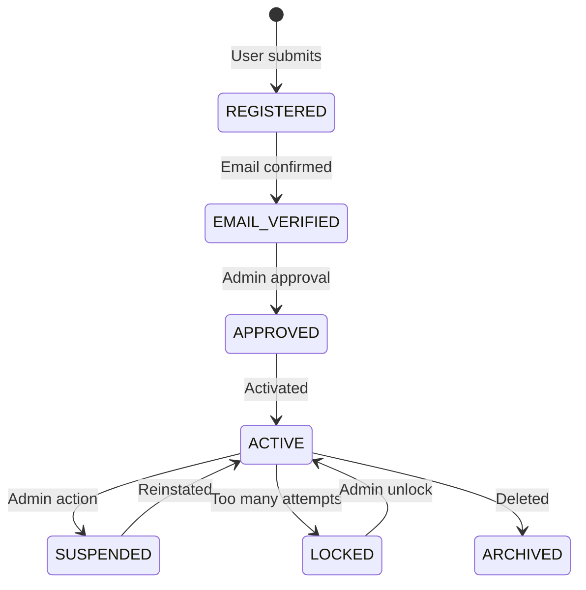

# Enterprise State Machines

**File:** `planning/051_ENTERPRISE_PROCESS_ARCHITECTURE/08_STATE_MACHINES/PROCESS_STATE_MACHINES.md`

---

## 1. Meter Lifecycle State Machine

## 2. Reading Lifecycle State Machine

## 3. Invoice Lifecycle State Machine

## 4. Payment Lifecycle State Machine

## 5. Collection Lifecycle State Machine

## 6. Accounting Period State Machine

## 7. Synchronization State Machine

## 8. User Registration & Approval State Machine

## State Machine Summary

| Machine | States | Transitions | Terminal States |
|---------|--------|-------------|-----------------|
| Meter Lifecycle | 7 | 10 | RETIRED |
| Reading Lifecycle | 7 | 10 | BILLED |
| Invoice Lifecycle | 10 | 14 | PAID, CANCELLED, CREDIT_NOTE |
| Payment Lifecycle | 8 | 10 | REFUNDED, FAILED |
| Collection Lifecycle | 10 | 12 | CLOSED |
| Accounting Period | 5 | 6 | LOCKED |
| Synchronization | 8 | 12 | COMPLETED, FAILED |
| User Registration | 7 | 8 | ARCHIVED |
