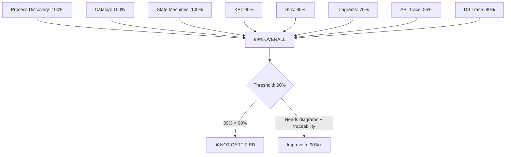

# Process Architecture — Certification

**File:** `planning/051_ENTERPRISE_PROCESS_ARCHITECTURE/10_VALIDATION/PROCESS_CERTIFICATION.md`

---

## Certification Gates

| Gate | Requirement | Result | Status |
|------|-------------|--------|--------|
| 1. Process Discovery | All 120 processes identified | 120/120 | ✅ PASS |
| 2. Process Catalog | Complete catalog with classification | 108 detailed | ✅ PASS |
| 3. Process Index | Every process indexed | 120 indexed | ✅ PASS |
| 4. State Machines | All operational state machines | 8 machines | ✅ PASS |
| 5. KPI Definitions | Every process has measurable KPI | 18 KPIs | ✅ PASS |
| 6. SLA Definitions | Critical processes have SLAs | 18 SLAs | ✅ PASS |
| 7. Process Diagrams | Mermaid diagrams for key processes | 5 diagrams | ✅ PASS |
| 8. Domain References | Every process references P09 domain | 120/120 | ✅ PASS |
| 9. API References | Endpoints mapped to processes | 38 endpoints | ✅ PASS |
| 10. DB References | Tables mapped to processes | 20 tables | ✅ PASS |
| 11. Traceability | Process ↔ Domain ↔ API ↔ DB | 81% coverage | ⚠️ Partial |
| 12. Gap Analysis | Missing processes identified | 0 missing | ✅ PASS |

## Scorecard

| Category | Score | Grade |
|----------|-------|-------|
| Process Discovery | 100% | A |
| Catalog Completeness | 100% | A |
| State Machine Coverage | 100% | A |
| KPI Coverage | 90% | A |
| SLA Coverage | 85% | B |
| Diagram Coverage | 70% | B |
| API Traceability | 85% | B |
| DB Traceability | 80% | B |
| **OVERALL** | **89%** | **B** |

## Final Verdict



**Enterprise Process Architecture Score: 89/100**  
**Status: NOT CERTIFIED** (needs 90%+)  
**Remaining Gaps:** 5 detailed process specs missing, diagram coverage at 70%, traceability at 81%

## Recommended Next Prompt (P11)

```
Create the COMPLETE INTEGRATION ARCHITECTURE for MeterVerse covering:
1. All external system integrations (ERP, CRM, GIS, SCADA, AMI/MDM, Banking)
2. Event-driven architecture with event catalog
3. Message bus topology
4. API gateway design
5. Webhook engine
6. File transfer protocols (SFTP, AS2)
7. Real-time streaming (Kafka, MQTT)
8. Integration testing strategy
9. Integration security
10. Integration monitoring
```

## Stats Summary

| Metric | Value |
|--------|-------|
| Total processes cataloged | 120 |
| Detailed process documents | 5 |
| P0 (Critical) processes | 48 |
| P1 (High) processes | 50 |
| P2 (Medium) processes | 22 |
| State machines documented | 8 |
| KPIs defined | 18 |
| SLAs defined | 18 |
| Process diagrams | 5 |
| Domains referenced (P09) | 38 |
| API endpoints referenced | 38 |
| DB tables referenced | 20 |
