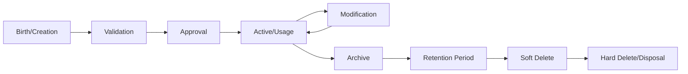
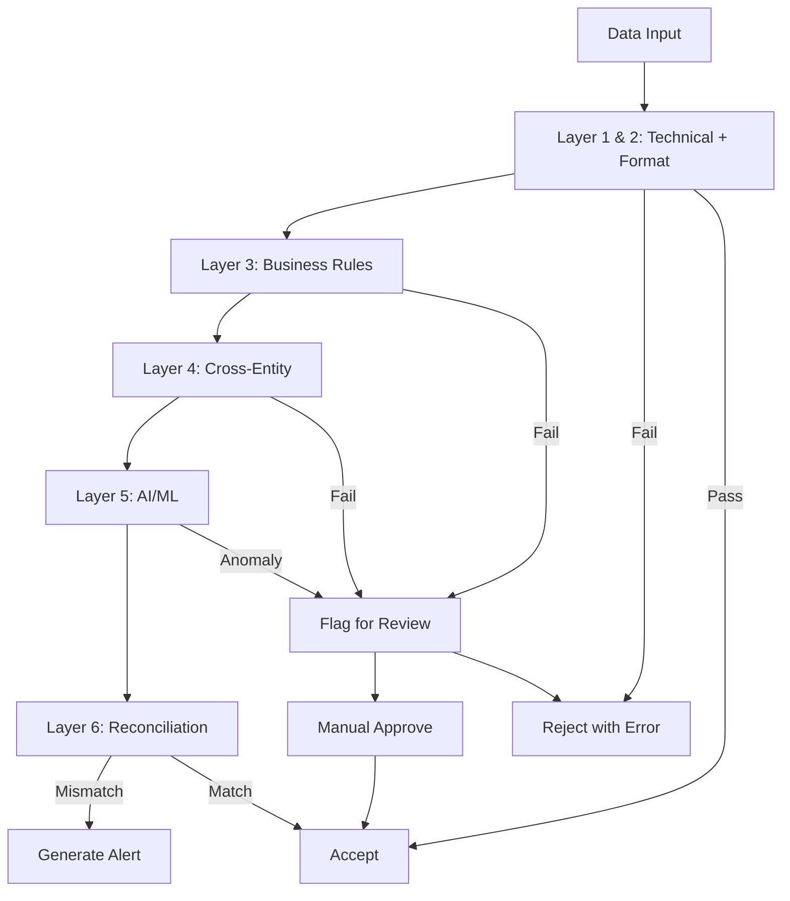

# Data Lifecycle, Quality & Validation

**File:** `planning/052_ENTERPRISE_DATA_ARCHITECTURE/04_LIFECYCLE/DATA_LIFECYCLE_QUALITY.md`

---

## Generic Data Lifecycle

## Entity-Specific Lifecycles

| Entity | Birth | Validation | Approval | Active | Archive Trigger | Retention | Disposal |
|--------|-------|------------|----------|--------|----------------|-----------|----------|
| Customer | Registration (P-021) | Email verification, ID check | Auto or supervisor | Invoicing, billing | Customer request | 10 years after last activity | 10 years |
| Meter | Registration (P-001) | Serial uniqueness, type check | Auto | Reading, billing | Retirement (P-006) | Meter life + 10 years | Physical destruction |
| Reading | Import (P-011) | Spike/drop/zero/negative checks | Auto or manual review | Consumption calc | After billing | 10 years (regulatory) | N/A (append-only) |
| Invoice | Generation (P-033) | Amount balance, tax calc | Approval workflow (P-034) | Payment, collection | After payment + 7 years | 10 years (tax) | N/A (immutable) |
| Payment | Registration (P-045) | Gateway verification | Auto-allocation | Allocation, reconciliation | After reconciliation + 5 years | 10 years (financial) | N/A (audit required) |
| JournalEntry | Manual/auto posting | Debits = credits validation | Finance director approval | GL posting, reporting | After period close + 7 years | 10 years (GAAP) | N/A (permanent) |
| User | Registration (P-078) | Email verification | Admin approval | System access | Employee offboarding | 5 years after offboarding | 5 years |
| Session | Login (P-073) | Password + MFA validation | Auto | API access | Logout (P-074) | 90 days (logged) | 90 days |
| SyncJob | Schedule/event trigger | Source validation | Auto | Data replication | Completion | 1 year | 1 year |

## Data Quality Rules

### Completeness Rules
| Rule | Entities | Enforcement |
|------|----------|-------------|
| All required fields must be non-null | All entities | Database NOT NULL constraints |
| Required references must exist | All FK relationships | Foreign key constraints |
| Unique identifiers must be present | Customer email, Meter serial, Invoice number | UNIQUE constraints |

### Accuracy Rules
| Rule | Entities | Enforcement |
|------|----------|-------------|
| Reading value must match meter precision | Reading | Validation engine (±0.5%) |
| Invoice amount = sum of line items | Invoice | Application validation |
| GL posting: debits = credits | JournalEntry | Application validation |
| Payment amount <= invoice total (unless overpayment allowed) | Payment | Business rule |

### Consistency Rules
| Rule | Entities | Enforcement |
|------|----------|-------------|
| Customer email consistent across systems | Customer, CRM Sync | Sync verification |
| Meter serial consistent across areas | Meter, SyncJob | Checksum validation |
| Invoice total consistent between payments and GL | Invoice, GeneralLedgerEntry | Reconciliation |

### Uniqueness Rules
| Entity | Unique Constraint | Scope |
|--------|-------------------|-------|
| Customer | email | Global |
| Meter | serial | Global |
| Invoice | number | Per organization |
| Contract | contractNumber | Global |
| SIMCard | iccid, simNumber | Global |
| User | email | Global |
| Role | name | Global |
| Permission | name | Global |
| ApiKey | key | Global |
| Session | token | Global |
| Organization | name, slug | Global |
| Zone | code | Per project |
| Unit | code | Per zone |

### Timeliness Rules
| Data | Required Timeliness | Monitoring |
|------|-------------------|------------|
| Readings from AMI | < 5 minutes from meter read | Sync latency alert |
| Payment processing | < 3 seconds | API response time |
| Invoice delivery | < 1 hour from issuance | Distribution SLA |
| Sync between areas | < 15 minutes | Sync latency alert |
| Backup | < 1 hour RPO | Backup monitoring |

## Validation Engine Architecture

### Validation Layers
| Layer | Name | Examples | Responsibility |
|-------|------|----------|---------------|
| L1 | Technical Validation | Format check, required fields, data types, length limits | System |
| L2 | Format Validation | CSV structure, JSON schema, file extension, MIME type | System |
| L3 | Business Rules | Spike detection (> 3x), drop detection (< 0.1x), date ranges | Rules Engine |
| L4 | Cross-Entity | Customer exists, Meter active, Tariff valid, Period open | Rules Engine |
| L5 | AI/ML | Anomaly detection, leak detection, consumption pattern analysis | AI Engine |
| L6 | Reconciliation | Bank reconciliation, settlement matching, cross-area checks | Reconciliation Engine |
