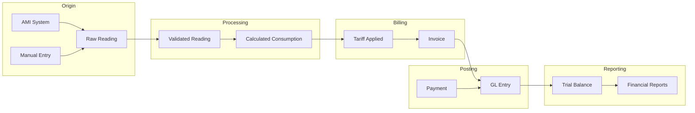

# Data Versioning, Lineage, Performance & Governance

**File:** `planning/052_ENTERPRISE_DATA_ARCHITECTURE/08_VERSIONING/DATA_VERSIONING_LINEAGE_PERFORMANCE.md`

---

## Data Versioning Strategy

### Versioning by Entity Type
| Entity Type | Versioning Strategy | Implementation |
|-------------|-------------------|----------------|
| Master Data (Customer, Meter, Contract) | Snapshot with version number | `version INT @default(1)` + history table |
| Transactional Data (Invoice, Payment) | Immutable (no versioning) | Append-only. Corrections = new record |
| Configuration Data | Full history with rollback | `beforeSnapshot`/`afterSnapshot` JSON |
| AI Data | Model version registry | Semantic versioning (MAJOR.MINOR.PATCH) |
| Operational Data (Sync, Import) | Status-based (no versioning) | State machine with transitions |

### Audit Entry Snapshot Strategy
```json
{
  "action": "customer.update",
  "actorId": "user-123",
  "resource": "customer",
  "resourceId": "cust-456",
  "beforeSnapshot": {
    "name": "Old Name",
    "email": "old@email.com",
    "status": "active"
  },
  "afterSnapshot": {
    "name": "New Name",
    "email": "new@email.com",
    "status": "active"
  },
  "correlationId": "corr-789"
}
```

### Rollback Capability
| Entity | Rollback Support | Method |
|--------|-----------------|--------|
| Customer | ✅ Yes | Reverse snapshot |
| Meter | ✅ Yes | Reverse snapshot |
| Configuration | ✅ Yes | Restore previous value |
| Invoice | ❌ No (immutable) | Credit note instead |
| Payment | ❌ No | Refund instead |
| JournalEntry | ⚠️ Limited | Reversing entry |
| ImportJob | ✅ Yes | Reverse import transaction |

---

## Data Lineage



### Lineage Tracking Requirements
| Hop | Source → Target | Transform | Audit |
|-----|----------------|-----------|-------|
| 1 | AMI → Raw Reading | API ingestion | Reading.createdAt |
| 2 | Raw → Validated | Validation rules applied | ValidationResult |
| 3 | Validated → Consumption | Current - Previous × CT/PT | Consumption record |
| 4 | Consumption → Tariff | Tariff rate applied | Tariff applied at time |
| 5 | Tariff → Invoice | Invoice generation | Invoice.generatedAt |
| 6 | Invoice → GL Posting | Debit/credit mapping | GeneralLedgerEntry |
| 7 | GL → Trial Balance | Period-end aggregation | FinancialPeriod.closedAt |

---

## Data Performance Strategy

### Partition Strategy
| Table | Partition Key | Partition Type | Retention |
|-------|--------------|----------------|-----------|
| Reading | timestamp | Monthly range partitions | 10 years |
| Invoice | issuedAt | Quarterly list partitions | 10 years |
| Payment | paidAt | Monthly range partitions | 10 years |
| AuditEntry | timestamp | Monthly range partitions | 2 years online |
| MetricPoint | timestamp | Weekly range partitions | 90 days |
| MeterEvent | timestamp | Monthly range partitions | 2 years |

### Index Strategy
| Pattern | Entities | Example |
|---------|----------|---------|
| Primary Key (UUID) | All entities | `@@id([id])` |
| Foreign Key | All relations | `@@index([meterId])` |
| Status + CreatedAt | Workflow entities | `@@index([status, createdAt])` |
| Unique Constraint | Identity entities | `@@unique([serial])` |
| Full-Text Search | Customer, Meter, Invoice | GIN index on `name` |
| Time-range queries | Reading, AuditEntry | BRIN index on `timestamp` |

### Caching Strategy
| Cache Type | Entities | TTL | Invalidation |
|------------|----------|-----|--------------|
| Redis | Configuration, MeterType, Tariff | 1 hour | On write |
| Redis | Active sessions | Until expiry | On logout |
| Redis | User permissions | 60 seconds | On role change |
| Application cache | Reference data | 5 minutes | On write |
| CDN | Static assets, Report PDFs | 1 day | On new version |

### Materialized Views
| View | Purpose | Refresh | Indexes |
|------|---------|---------|---------|
| customer_balance | Running balance per customer | On payment/invoice | Customer ID |
| meter_latest_reading | Latest reading per meter | On new reading | Meter ID |
| monthly_revenue | Revenue aggregated by month | On invoice generation | Month |
| aging_summary | AR aging buckets per customer | Daily | Customer ID, Bucket |
| area_sync_status | Current sync state per area | On sync event | Area, Entity type |

---

## Data Governance Framework

| Domain | Data Trustee | Council | Review Frequency |
|--------|-------------|---------|-----------------|
| Customer Data | CCO (Chief Customer Officer) | Data Governance Council | Quarterly |
| Meter Data | COO (Chief Operations Officer) | Data Governance Council | Quarterly |
| Financial Data | CFO (Chief Financial Officer) | Data Governance Council | Monthly |
| Platform Data | CTO (Chief Technology Officer) | Architecture Review Board | Bi-weekly |
| AI Data | CAIO (Chief AI Officer) | AI Ethics Board | Monthly |

### Governance Processes
| Process | Owner | Input | Output |
|---------|-------|-------|--------|
| Data Quality Review | Data Steward | Quality metrics dashboard | Improvement plan |
| Schema Change Request | Data Architect | Change proposal | Approved/rejected schema |
| Data Access Review | Security Analyst | Access audit log | Revoked/granted permissions |
| Retention Audit | Compliance Officer | Retention schedule | Entities to archive/purge |
| Privacy Impact Assessment | DPO (Data Protection Officer) | New data collection | PIA approval/conditions |
