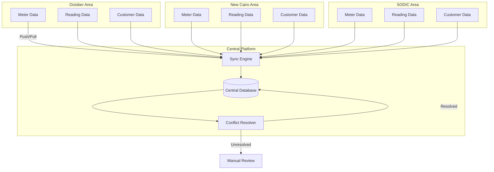
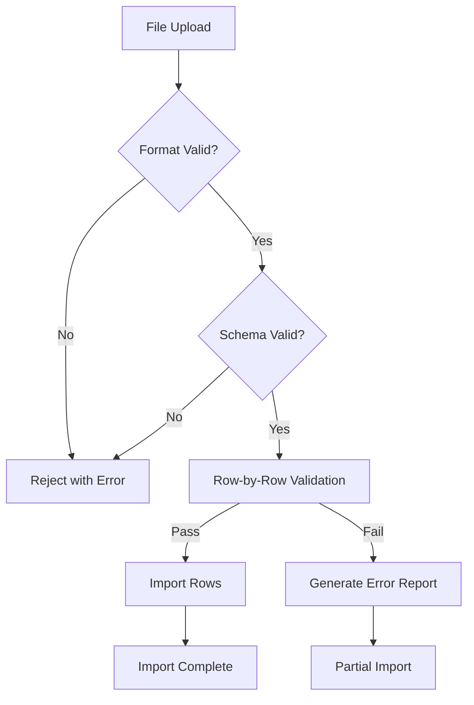
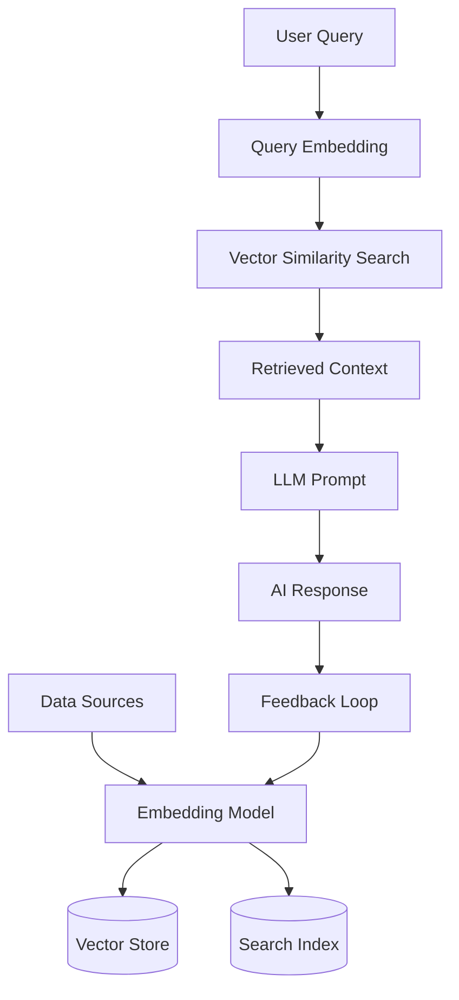

# Data Synchronization, Import/Export & AI Architecture

**File:** `planning/052_ENTERPRISE_DATA_ARCHITECTURE/11_SYNCHRONIZATION/DATA_SYNC_IMPORT_EXPORT_AI.md`

---

## Data Synchronization Architecture

### Sync Types
| Type | Direction | Frequency | Protocol | Verification |
|------|-----------|-----------|----------|--------------|
| Meter Data | Bidirectional | Every 15min | REST + Checksum | SHA-256 hash |
| Reading Data | Area → Central | Real-time | REST | Timestamp ordering |
| Customer Data | Central → Area | Hourly | REST + Full sync nightly | Record count |
| Invoice Data | Central → Area | After generation | REST | Checksum |
| Payment Data | Central → Area | Real-time | REST | Idempotency key |
| Configuration | Central → Areas | On change | REST + Version | Version number |

### Conflict Resolution Strategy
| Data Type | Resolution | Audit |
|-----------|------------|-------|
| Meter Data | Last-writer-wins by timestamp | Full conflict log |
| Reading Data | Append-only (no conflicts possible) | N/A |
| Customer Data | Last-writer-wins + manual review option | Conflict + resolution logged |
| Configuration | Central authority (area cannot override) | Override attempt logged |

---

## Import/Export Platform

### Supported Formats
| Format | Import | Export | Bulk | Streaming |
|--------|--------|--------|------|-----------|
| CSV | ✅ | ✅ | ✅ | ✅ |
| Excel (.xlsx) | ✅ | ✅ | ✅ | ❌ |
| JSON | ✅ | ✅ | ✅ | ✅ |
| XML | ✅ | ✅ | ❌ | ❌ |
| PDF | ❌ | ✅ (Reports) | ❌ | ❌ |
| EDI-867 | ✅ (Settlements) | ❌ | ✅ | ❌ |

### Import Validation Pipeline

---

## AI Data Architecture

### Knowledge Storage

### AI Data Entities
| Entity | Storage | Format | Retention | Backup Priority |
|--------|---------|--------|-----------|----------------|
| Prompts | PostgreSQL | JSON | Indefinite | High |
| Embeddings | Vector DB (pgvector) | Float array | 1 year | Medium |
| Conversations | PostgreSQL | JSON | 30 days | Low |
| Knowledge | PostgreSQL | Full text | Indefinite | High |
| Training Data | Object Store | Parquet | Per model version | High |
| Model Registry | PostgreSQL | JSON | Indefinite | High |

### RAG Architecture
| Component | Technology | Purpose |
|-----------|-----------|---------|
| Vector Store | pgvector (PostgreSQL extension) | Store and search embeddings |
| Embedding Model | text-embedding-3-small (OpenAI) or all-MiniLM-L6-v2 (local) | Convert text to vectors |
| LLM | llama-3.1-8b (Cloudflare), GPT-4o-mini (fallback) | Generate responses |
| Context Window | 8K tokens | Maximum context length |
| Chunk Strategy | Overlapping chunks (256 tokens, 32 token overlap) | Document splitting |
| Retrieval | Hybrid (vector + keyword) | Best relevance |
| Ranking | Cross-encoder re-ranking | Precision improvement |
