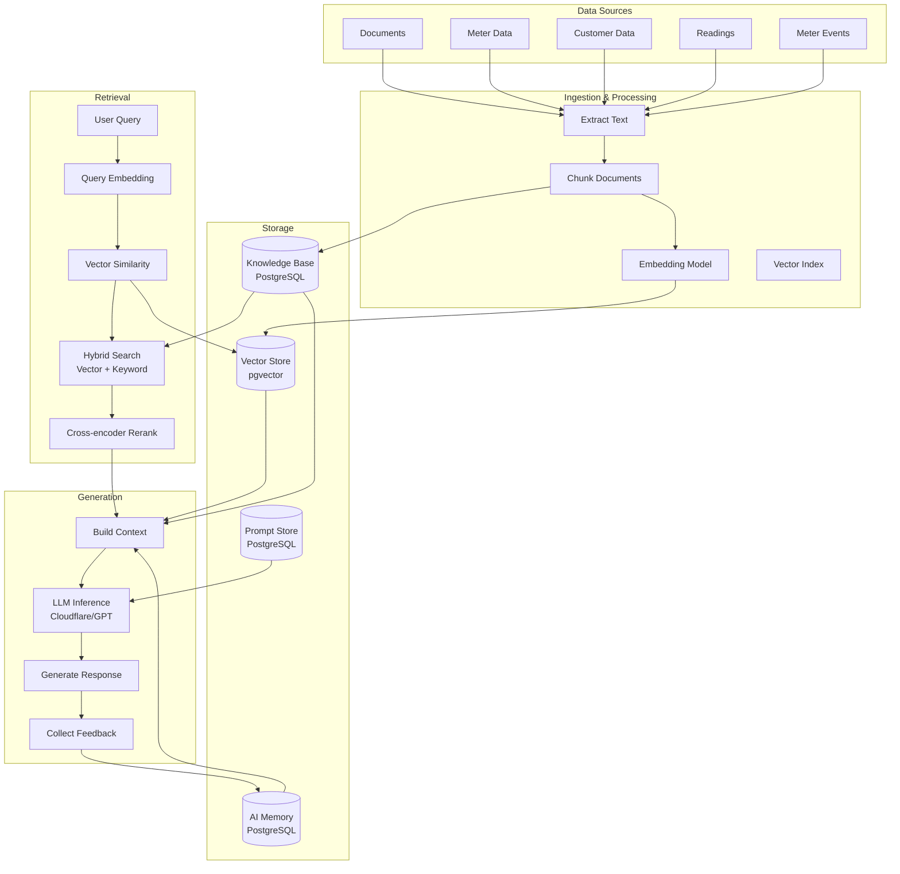

# AI Data Architecture — Diagram D-008

**File:** `14_AI_DATA/AI_DATA_ARCHITECTURE.md`

## AI Data Components
| Component | Storage | Format | Retention |
|-----------|---------|--------|-----------|
| Vector Store | pgvector | Float[] | 1 year |
| Knowledge Base | PostgreSQL | Text + Metadata | Indefinite |
| AI Memory | PostgreSQL | JSON | 30 days |
| Prompt Store | PostgreSQL | Template + Variables | Indefinite |
| Feedback | PostgreSQL | Score + Comment | 1 year |
| Conversations | PostgreSQL | Message[] | 30 days |
| Training Data | Object Store | Parquet | Per model version |
