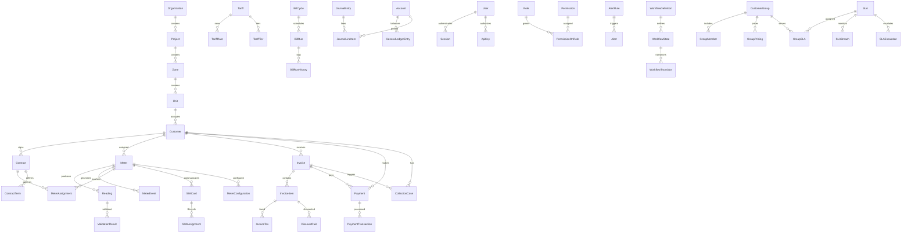
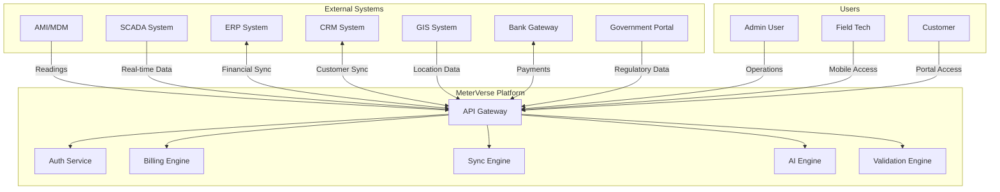
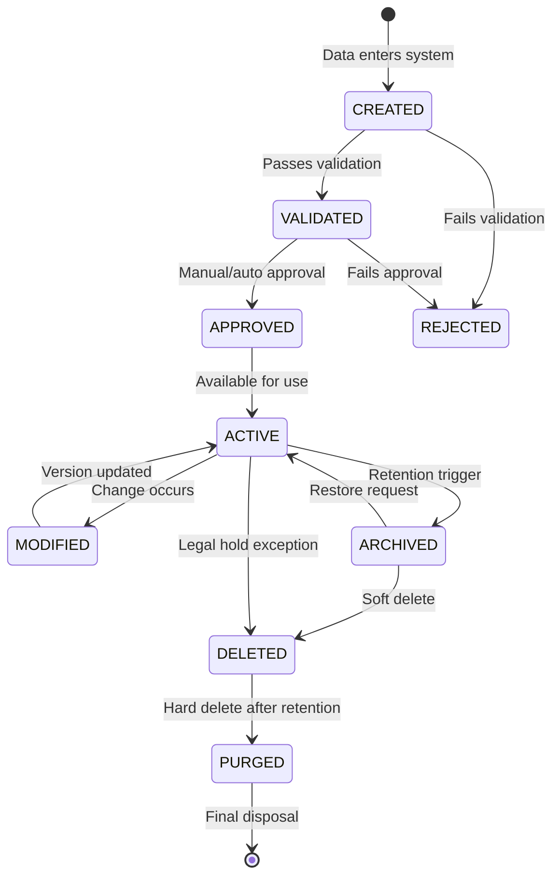

# Enterprise ERD & Data Flow Diagrams

**File:** `planning/052_ENTERPRISE_DATA_ARCHITECTURE/17_DIAGRAMS/ENTERPRISE_ERD.md`

---

## Enterprise Entity Relationship Diagram (Logical)



## Data Flow Diagram (Context Level)



## Data Replication Diagram

```mermaid
graph TD
    subgraph "Primary (Central)"
        P_DB[(Primary Database)]
        P_APP[Application Servers]
    end
    
    subgraph "Standby (DR)"
        S_DB[(Standby Database)]
        S_APP[Standby Servers]
    end
    
    subgraph "October Area"
        O_APP[October App]
        O_DB[(October Cache)]
    end
    
    subgraph "New Cairo Area"
        NC_APP[New Cairo App]
        NC_DB[(New Cairo Cache)]
    end
    
    subgraph "SODIC Area"
        SOD_APP[SODIC App]
        SOD_DB[(SODIC Cache)]
    end
    
    P_DB <-->|Streaming Replication| S_DB
    P_APP -->|Read/Write| P_DB
    O_APP -->|Read (Cached)| O_DB
    O_APP -->|Write| P_APP
    NC_APP -->|Read (Cached)| NC_DB
    NC_APP -->|Write| P_APP
    SOD_APP -->|Read (Cached)| SOD_DB
    SOD_APP -->|Write| P_APP
    
    S_APP -->|Read| S_DB
```

## Data Lifecycle State Diagram


