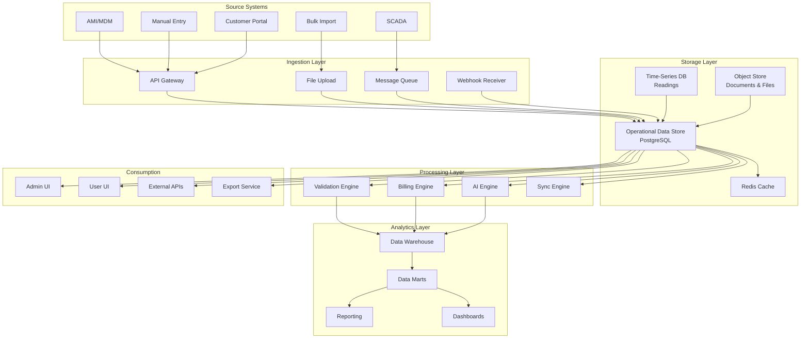

# MeterVerse — Enterprise Data Architecture

**File:** `planning/052_ENTERPRISE_DATA_ARCHITECTURE/ENTERPRISE_DATA_ARCHITECTURE.md`
**Version:** 1.0.0
**Date:** 2026-07-26
**Status:** Part III — Prompt P11 — Enterprise Data Architecture

---

## Platform Data Principles

1. **Single Source of Truth** — Each data entity has one authoritative source
2. **Immutable Audit Trail** — All financial and critical operational data is append-only
3. **Data at Rest Encryption** — All PII and financial data encrypted (AES-256)
4. **Soft Delete First** — ArchivedAt pattern for all mutable entities
5. **Version Every Mutation** — Every change creates a new version
6. **Trace Every Read** — Data lineage tracked from origin to consumption
7. **Classify Everything** — Every entity classified by sensitivity, retention, and ownership
8. **Sync with Verification** — Every cross-area sync verified by checksum
9. **Retention by Law** — Retention policies comply with utility, tax, and privacy regulations
10. **Data Quality Gates** — Every import, migration, and sync passes quality validation

## Architecture Overview

## Entity Count

| Category | Count | Examples |
|----------|-------|----------|
| Master Data Entities | 12 | Customer, Meter, Contract, Unit, Zone, Project, Organization |
| Reference Data Entities | 8 | MeterType, Tariff, ChargeRule, Currency, Account |
| Transactional Data Entities | 28 | Reading, Invoice, Payment, JournalEntry, CollectionCase |
| Operational Data Entities | 15 | SyncJob, ImportJob, ExportJob, Backup, Notification |
| Configuration Data Entities | 10 | SystemSetting, FeatureFlag, AlertRule, WorkflowDefinition |
| Security Data Entities | 6 | User, Role, Permission, ApiKey, Session, Policy |
| AI Data Entities | 8 | Prompt, Memory, Knowledge, Embedding, Context, Training, Feedback, Conversation |
| Document & Media Entities | 5 | StoredFile, Document, Attachment, Template, Media |
| Log & Audit Entities | 4 | AuditEntry, ActivityStream, EmailLog, SmsLog |
| **Total** | **96** | |

## Cross-Reference

| Phase | Document | Reference |
|-------|----------|-----------|
| P09 | Domain Architecture | `050_ENTERPRISE_DOMAIN_ARCHITECTURE/` |
| P10 | Process Architecture | `051_ENTERPRISE_PROCESS_ARCHITECTURE/` |
| P11 | Data Architecture | This directory |
| Backend | Prisma Schema | `backend/prisma/schema.prisma` |
